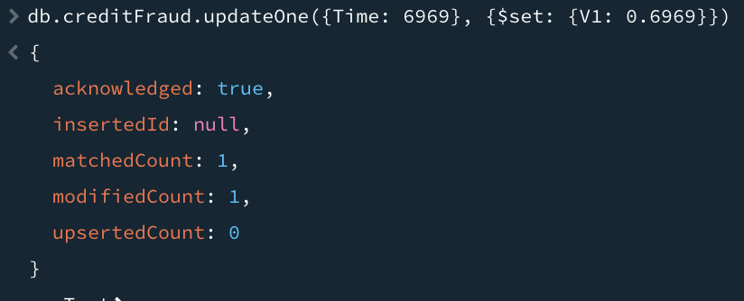
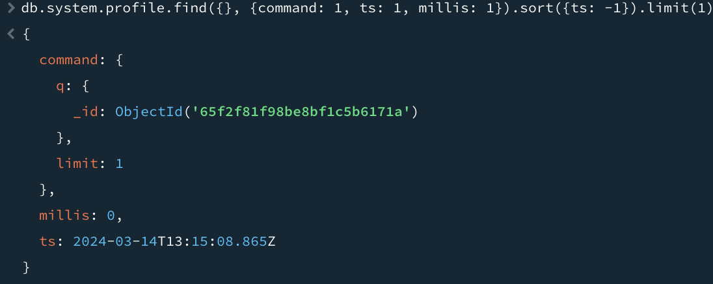
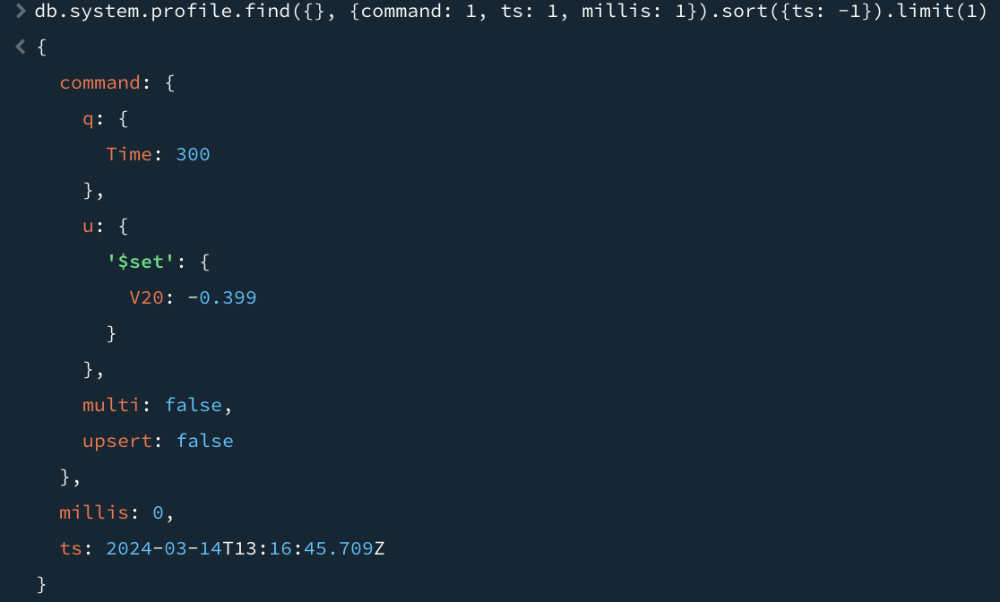

# Шаг 1. Выбор датасета

В качестве рассматриваемого датасета возьмем данные по банковским операциям с использованием кредитных карт.

# Шаг 2. Создание базы данных и загрузка датасета

Создадим БД локально, используя GUI и загрузим данные из csv файла.

# Шаг 3. Выполнение CRUD запросов без индекса

1. Find

Проверим, что данные загрузились валидно. Для этого выполним запрос поиска:

Посмотрим на время выполнения. Оно составило 3 мс.

2. Insert

Запрос вставки:

Запрос вставки выполнился за 0 мс.

3. Delete

Запрос удаления:

Запрос удаления выполнился за 1 мс.

4. Update

Запрос обновления:

Запрос обновления выполнился за 6 мс.

# Шаг 4. Создание индекса

Создадим индекс для текущей таблицы creditFraud

# Шаг 5. Выполнение CRUD запросов с индексом

1. Find

Выполним запрос поиска уже с использованием индекса

Посмотрим на время выполнения. Оно составило 0 мс.

2. Insert

Запрос вставки:

Запрос вставки выполнился за 0 мс.

3. Delete

Запрос удаления:

Запрос удаления выполнился за 0 мс.

4. Update

Запрос обновления:

Запрос обновления выполнился за 0 мс.

# Выводы:

Индекс существенно ускоряет CRUD-запросы. Для данного датасета ускорение позволило мгновенно выполнять запросы.