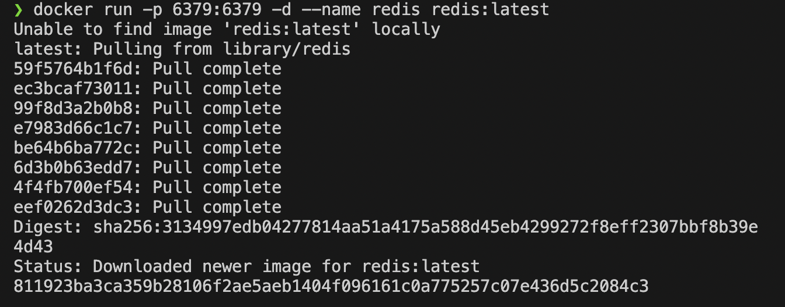
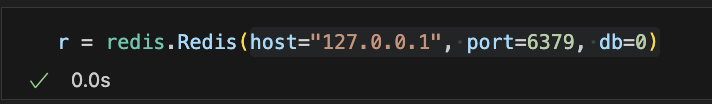
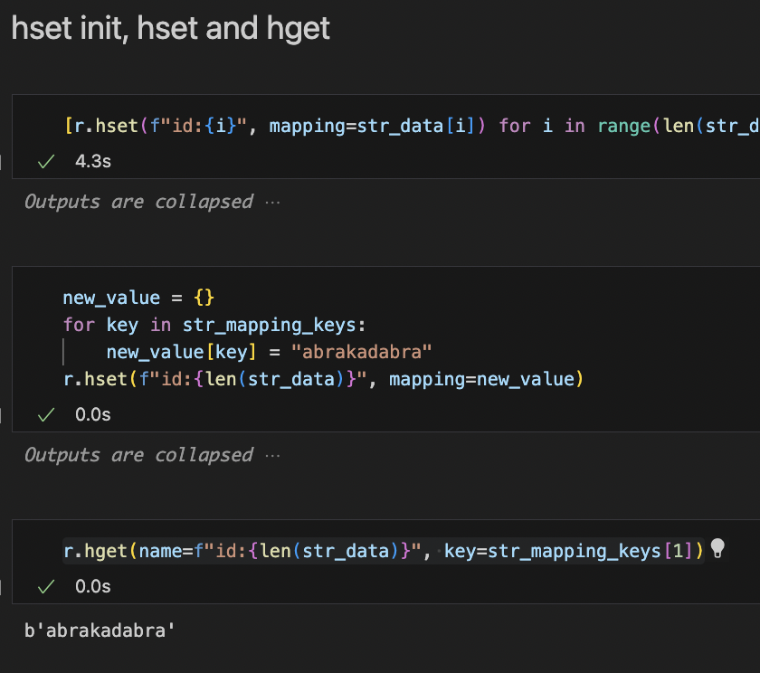
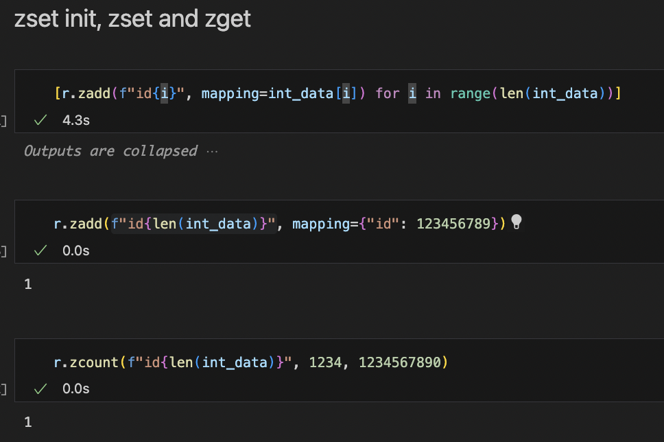
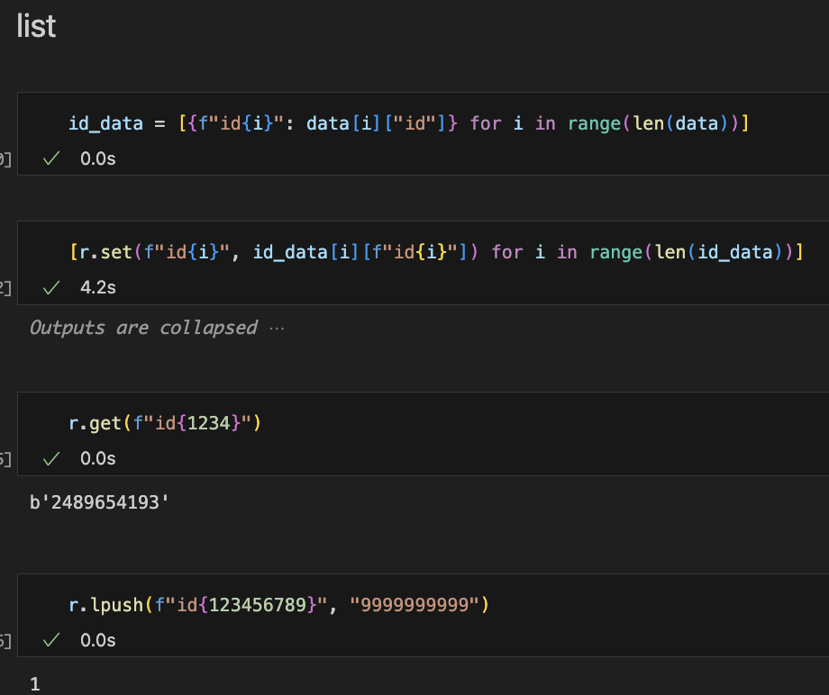
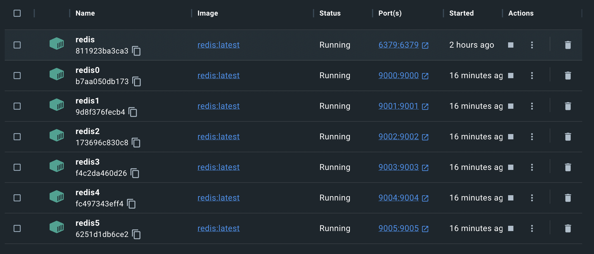
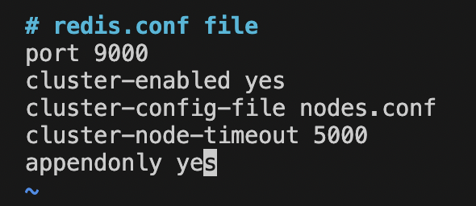
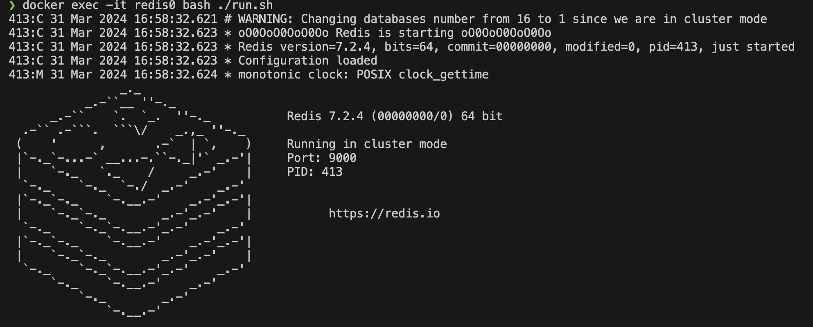
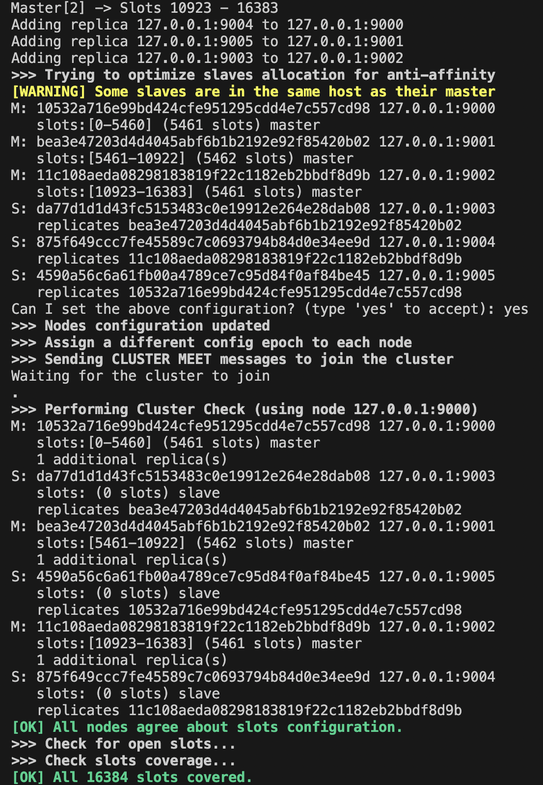
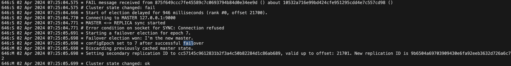

# Создание Redis-сервера

Создадим Redis-сервер в докере, предварительно пробросив порты:

# Работа с json: строка, hset, zset, list

Подключимся к серверу, используя python api:

Загрузим большой json (26MB) на сервер.
Далее выполним различные команды по вставке и чтению:

# Настройка кластера

После работы с сервером можем настроить кластер. Для учебных целей достаточно 6 нод (3 master и 3 slave), однако на практике обычно используют 9 нод в данном случае, дабы избежать split-brain issue (когда каждая нода считает себя главной).

Итак, создадим множество контейнеров с redis-server:

Далее в каждом контейнере сделаем конфиг для ноды:

Запустим 6 redis серверов:

Далее объединяем ноды в кластер:

Проверим кластер на прочность, отключив одну мастер-ноду:

Как видим, сервер не упал и после произошла синхронизация.
