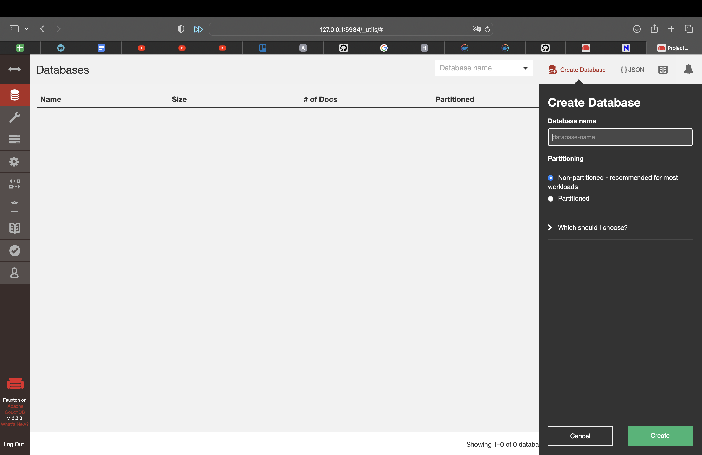
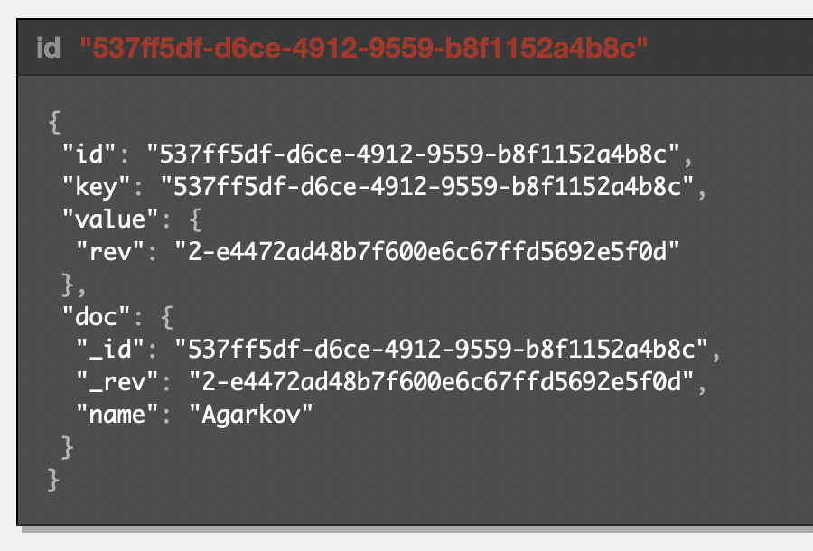
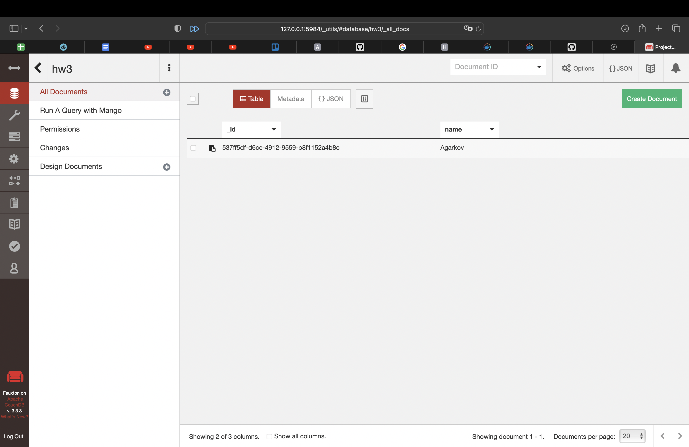
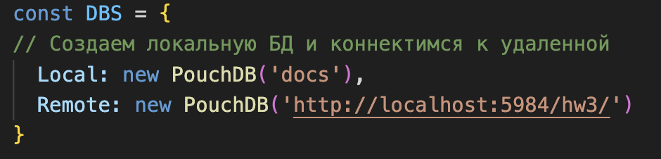
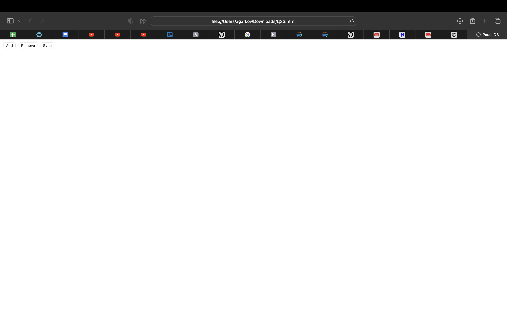
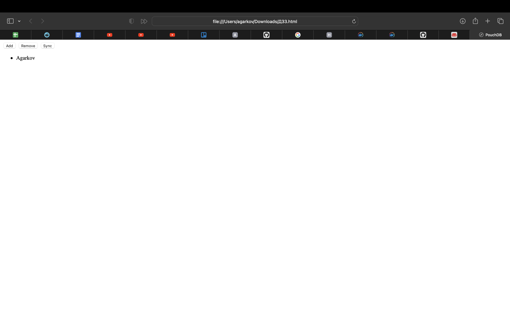
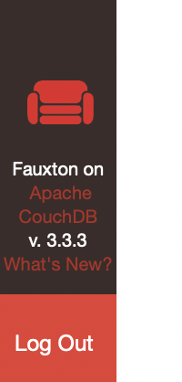
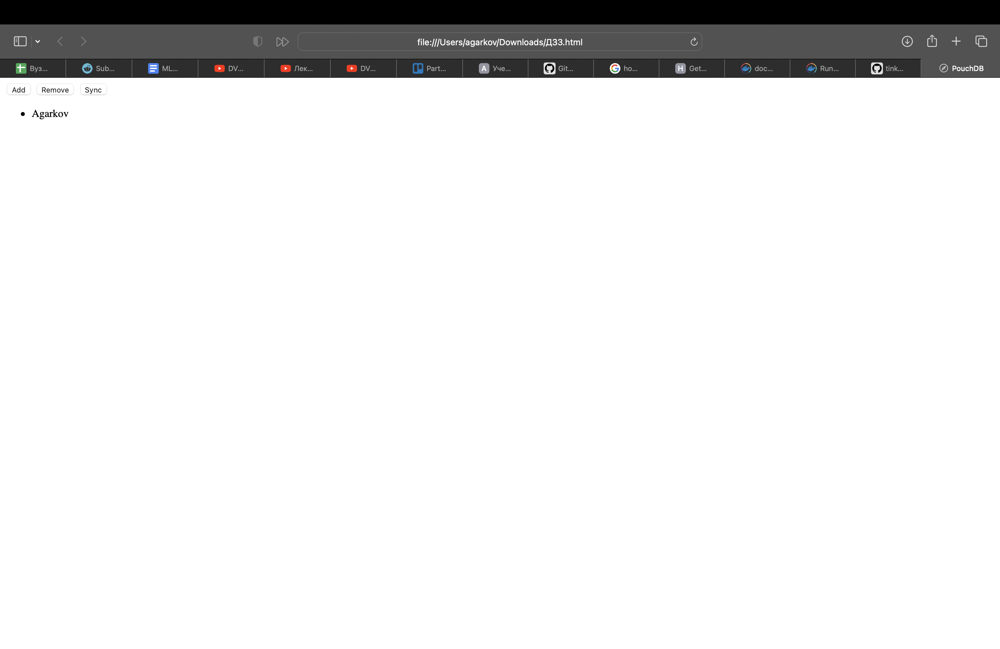

# Создадим базу данных в CouchDB

Скачаем клиент couch db и запустим локальный сервер. Далее создадим базу данных с названием hw3:

# Добавление полей в БД

Создадим документ и добавим в него поле name. Это можно сделать через json формат:

В итоге в БД появится документ с name:

# Синхронизация

Изменим html скрипт, добавив в него информацию про базу данных:

Теперь в браузере можно отобразить html документ и сделать синхронизацию:

Фамилия появилась!

# Offline режим

Выйдем из аккаунта и клиента:

Зайдем на html страницу, обновим ее и нажмем синхронизацию:

Фамилия синхронизировалась!
