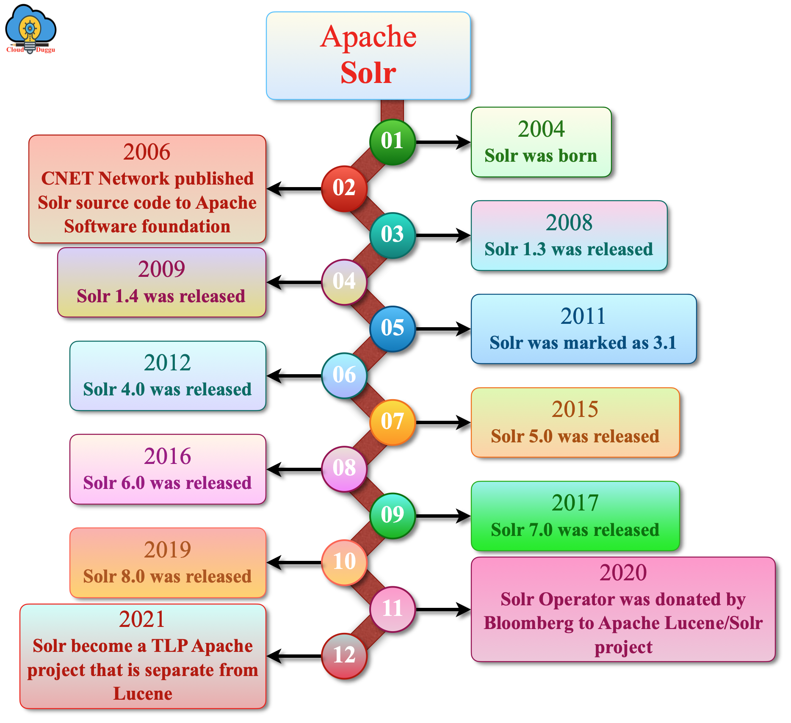
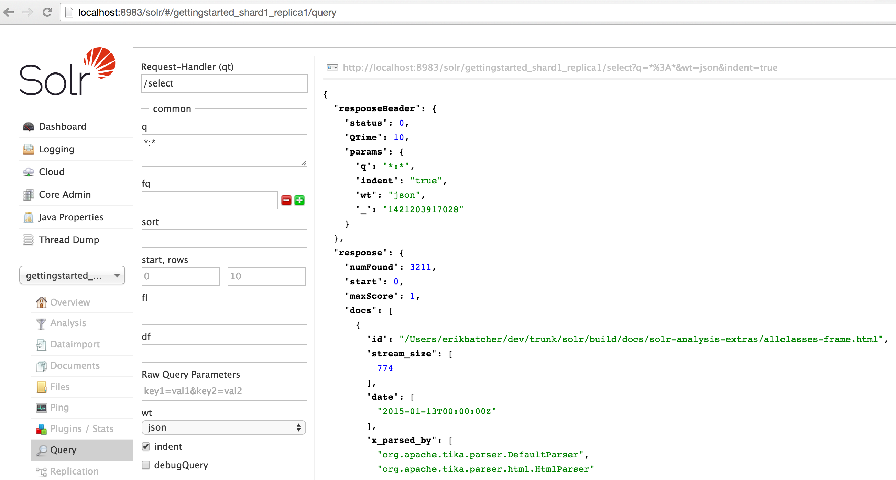
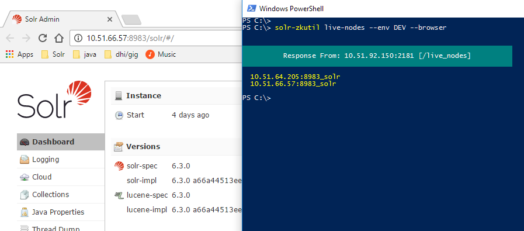
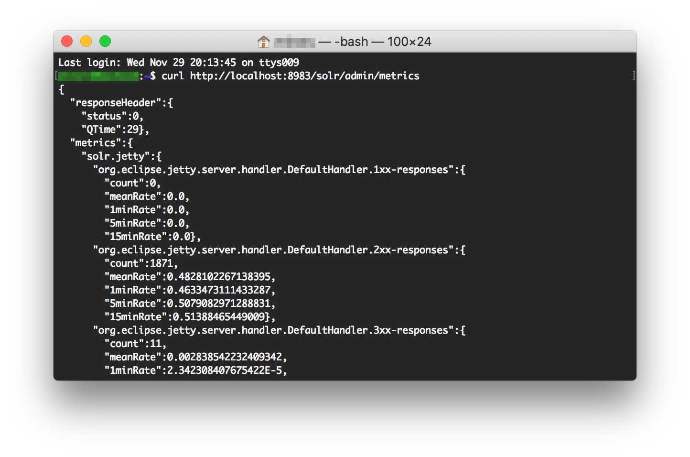
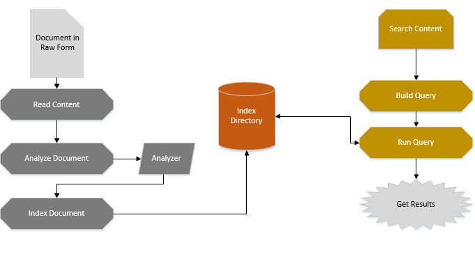
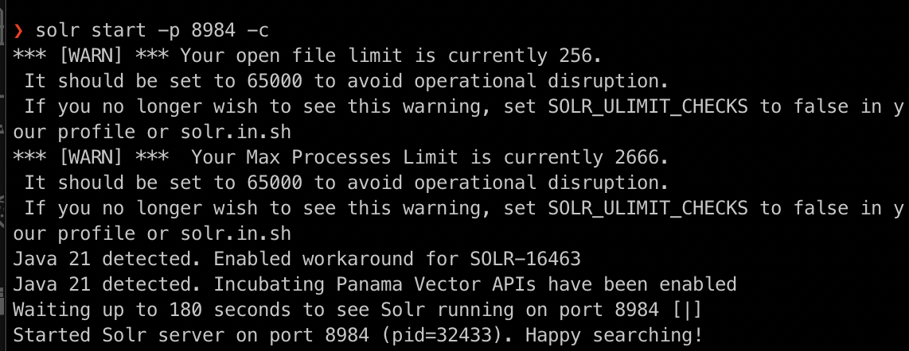
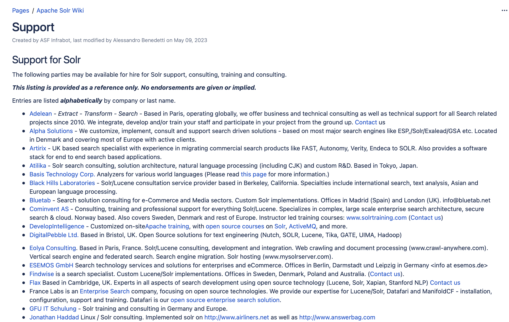
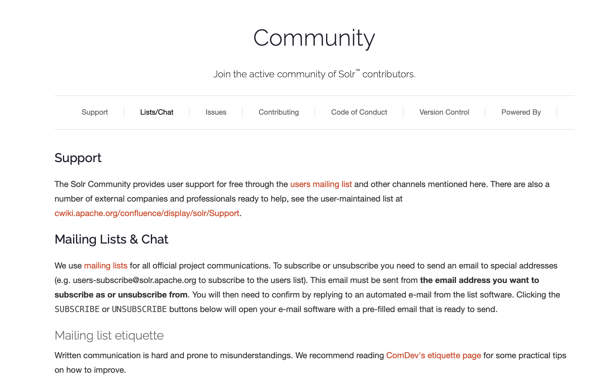

# **SOLR Search Engine Database Report**

## **Introduction**

SOLR (произносится как "solar") - это поисковая база данных с открытым исходным кодом, созданная на базе Apache Lucene, высокопроизводительной поисковой библиотеки. SOLR широко используется для создания поисковых приложений и особенно хорошо подходит для крупномасштабных веб-сайтов с высокой посещаемостью.


## **История развития СУБД**

SOLR была впервые выпущена в 2006 году компанией CNET Networks, которая позже была приобретена Apache Software Foundation. С тех пор SOLR стала одной из самых популярных поисковых систем с открытым исходным кодом, с большим сообществом разработчиков и пользователей.

В 2021 году SOLR стала отдельным от Luccence проектом TLP Apache.



## **Инструменты для взаимодействия с СУБД**

SOLR предоставляет несколько инструментов для взаимодействия с базой данных, в том числе:

- **SOLR Admin UI**: Веб-интерфейс для управления базой данных и запросов к ней.

- **SOLRJ**: Клиентская библиотека Java для взаимодействия с SOLR.

Можно посмотреть подробнее по ссылке, [как сбилдить SORJ приложение](https://solr.apache.org/guide/8_1/using-solrj.html): 
- **curl**: Инструмент командной строки для отправки HTTP-запросов в SOLR.

- **SOLR CLI**: Инструмент командной строки для управления базой данных и запросов к ней.


## **Ядро базы данных**

SOLR использует библиотеку поисковой системы Apache Lucene в качестве движка базы данных. Lucene предоставляет высокопроизводительную, масштабируемую и гибкую поисковую систему, которая может обрабатывать большие объемы данных.


## **Язык Запросов**

SOLR использует язык запросов, аналогичный SQL, но с некоторыми отличиями. Вот пример простого запроса:

```sql
q=*:* // returns all documents
```

SOLR также поддерживает более сложные запросы, такие как:

```sql
q=title:hello AND content:world // returns documents with "hello" in the title and "world" in the content
```

## **Развертывание БД с данными и выполнение запросов**

Создадим базу данных. Для этого сначала потребуется скачать Джаву :)

Скачаем SOLR и запустим SOLR в cloud режиме на 8984 порте:


Далее можно создать json со следующим содержанием:

```json

[
  {
    "id": 0,
    "name": "Micael Taylor",
    "age": 40,
    "city": "San Francisco"
  },
  {
    "id": 1,
    "name": "Patrick Thomas",
    "age": 32,
    "city": "Delaware"
  },
  {
    "id": 2,
    "name": "Oliver Davies",
    "age": 65,
    "city": "Delaware"
  },
  {
    "id": 3,
    "name": "Bob William",
    "age": 32,
    "city": "Chicago"
  },
  {
    "id": 4,
    "name": "Victor Evans",
    "age": 34,
    "city": "Delaware"
  },
  ...
]
```
В документе будет 1000 записей. Загрузим json в созданную коллекцию mycollection в SOLR:

```bash
curl -X POST 'http://localhost:8984/solr/mycollection/update' -H 'Content-Type: application/json' -d @data.json
{
  "responseHeader":{
    "rf":1,
    "status":0,
    "QTime":329
  }
}%
```

Загрузка прошла успешно, далее выполним различные запросы:

1. Веведем все документы:

```bash
curl 'http://localhost:8984/solr/mycollection/select?q=*:*'
{
  "responseHeader":{
    "zkConnected":true,
    "status":0,
    "QTime":29,
    "params":{
      "q":"*:*"
    }
  },
  "response":{
    "numFound":1000,
    "start":0,
    "numFoundExact":true,
    "docs":[{
      "id":"0",
      "name":["Micael Taylor"],
      "age":[40],
      "city":["San Francisco"],
      "_version_":1797239179045765120
    },
    ...
    ]
  }
}%
```
Видим, что найдено ровно 1000 записей, которые мы и загружали.

2. Найдем всех людей с именем Oliver Davies:
```bash
curl 'http://localhost:8984/solr/mycollection/select?q=name:Oliver+Davies'
{
  "responseHeader":{
    "zkConnected":true,
    "status":0,
    "QTime":55,
    "params":{
      "q":"name:Oliver Davies"
    }
  },
  "response":{
    "numFound":122,
    "start":0,
    "numFoundExact":true,
    "docs":[{
      "id":"2",
      "name":["Oliver Davies"],
      "age":[65],
      "city":["Delaware"],
      "_version_":1797239179095048193
    },
    ...
    ]
  }
}%
```
Найдено 122 человека!

3. Найти всех людей из Delaware:

```bash
curl 'http://localhost:8984/solr/mycollection/select?q=city:Delaware'
{
  "responseHeader":{
    "zkConnected":true,
    "status":0,
    "QTime":12,
    "params":{
      "q":"city:Delaware"
    }
  },
  "response":{
    "numFound":156,
    "start":0,
    "numFoundExact":true,
    "docs":[{
      "id":"1",
      "name":["Patrick Thomas"],
      "age":[32],
      "city":["Delaware"],
      "_version_":1797239179095048192
    },
    ...
    ]
  }
}%
```
В Делавере мы нашли 156 человек!

4. Теперь посчитаем количество людей в каждом городе. (Должно получиться примерно одинаковое количество, так как я генерировал данные рандомно).

```bash
curl 'http://localhost:8984/solr/mycollection/select?q=*:*&facet=true&facet.field=city'
{
  "responseHeader":{
    "zkConnected":true,
    "status":0,
    "QTime":18,
    "params":{
      "q":"*:*",
      "facet.field":"city",
      "facet":"true"
    }
  },
  "response":{
    "numFound":1000,
    "start":0,
    "numFoundExact":true,
    "docs":[{
      "id":"0",
      "name":["Micael Taylor"],
      "age":[40],
      "city":["San Francisco"],
      "_version_":1797239179045765120
    },
    ...
    ]
  },
  "facet_counts":{
    "facet_queries":{ },
    "facet_fields":{
      "city":["chicago",178,"boston",172,"new",171,"york",171,"francisco",164,"san",164,"angeles",159,"los",159,"delaware",156]
    },
    "facet_ranges":{ },
    "facet_intervals":{ },
    "facet_heatmaps":{ }
  }
}%
```
Действительно, в каждом из городов живет примерно 165 человек.

5. Теперь посчитаем количество людей из делавера, которым 32 года:

```bash
curl 'http://localhost:8984/solr/mycollection/select?q=city:Delaware+AND+age:32'
{
  "responseHeader":{
    "zkConnected":true,
    "status":0,
    "QTime":30,
    "params":{
      "q":"city:Delaware AND age:32"
    }
  },
  "response":{
    "numFound":4,
    "start":0,
    "numFoundExact":true,
    "docs":[{
      "id":"1",
      "name":["Patrick Thomas"],
      "age":[32],
      "city":["Delaware"],
      "_version_":1797239179095048192
    },{
      "id":"256",
      "name":["Patrick Smith"],
      "age":[32],
      "city":["Delaware"],
      "_version_":1797239179147476995
    },{
      "id":"923",
      "name":["Max Evans"],
      "age":[32],
      "city":["Delaware"],
      "_version_":1797239179200954384
    },{
      "id":"924",
      "name":["Frank Evans"],
      "age":[32],
      "city":["Delaware"],
      "_version_":1797239179200954385
    }]
  }
}%
```
Найдено 4 человека!

## **Распределение файлов БД по разным носителям**

SOLR поддерживает распространение файлов базы данных на различных носителях, таких как:

- **Локальная файловая система**: SOLR может хранить свои индексные файлы в локальной файловой системе.
- **HDFS (распределенная файловая система Hadoop)**: SOLR может хранить свои индексные файлы в кластере HDFS.
- ** Облачное хранилище**: SOLR может хранить свои индексные файлы в облачных сервисах хранения, таких как Amazon S3 или Microsoft Azure Blob Storage.

## **На каком языке программирования написана SOLR**

SOLR написан на Java. В этом мы убедились, когда скачивали БД, чтобы запустить ее и сделать запросы :)

## **Какие типы индексов поддерживаются в SOLR**

SOLR поддерживает несколько типов индексов, включая:

- **Индекс терминов**: Индекс терминов (слов) в базе данных.
- **Индекс фраз**: Индекс фраз в базе данных.
- **Индекс NGram**: Индекс n-грамм (последовательностей из n элементов) в базе данных.

Вот пример создания индекса:

```xml
<field name="content" type="text" indexed="true" stored="true"/>
```

Это создало бы текстовое поле с именем "содержимое", которое индексируется и сохраняется.

## **Как строится процесс выполнения запросов в SOLR**

Процесс выполнения запроса в SOLR включает в себя следующие этапы:

1. **Синтаксический анализ запроса**: Запрос преобразуется в объект запроса Lucene.
2. **Поиск по индексу**: Запрос выполняется по индексу для получения соответствующих документов.
3. ** Поиск документов**: Соответствующие документы извлекаются из хранилища.
4. **Ранжирование результатов**: Полученные документы ранжируются в соответствии с их релевантностью.
5. **Фильтрация результатов**: Ранжированные результаты фильтруются в соответствии с фильтрами запроса.

## **План запросов**

SOLR использует план запроса для оптимизации процесса выполнения запроса. План запроса создается на основе запроса и структуры индекса.

## **Transactions**

SOLR не поддерживает транзакции в классическом смысле этого слова. Однако он поддерживает атомарные обновления, которые гарантируют, что будут применены либо все изменения, либо ни одно из них.

## **Методы восстановления**

SOLR поддерживает несколько методов восстановления, в том числе:

- **Журнал транзакций**: SOLR использует журнал транзакций для записи всех изменений в индекс.
- **Моментальный снимок индекса**: SOLR может создавать моментальный снимок индекса через регулярные промежутки времени.
- **Репликация**: SOLR может реплицировать индекс на несколько узлов.

## **Sharding**

SOLR поддерживает сегментирование, которое позволяет распределять базу данных по нескольким узлам. SOLR использует метод, называемый "последовательное хэширование", для распределения документов по сегментам.

## **Data Mining, Data Warehousing, и OLAP**

SOLR можно использовать для интеллектуального анализа данных, создания хранилищ данных и OLAP (онлайн-аналитической обработки), особенно в сочетании с другими инструментами обработки больших данных, такими как Apache Spark и Apache Hive.

## **Какие методы защиты поддерживаются SOLR**

SOLR поддерживает несколько методов обеспечения безопасности, в том числе:

- **Аутентификация**: SOLR поддерживает аутентификацию с использованием таких плагинов, как Basic Auth и Kerberos.
- **Авторизация**: SOLR поддерживает управление доступом на основе ролей (RBAC) с использованием таких плагинов, как авторизация на основе правил.
- **Шифрование**: SOLR поддерживает шифрование с использованием SSL/TLS.

## **Сообщество и развитие**

Сообщество Solr - это разнообразная группа частных лиц и организаций, которые вносят свой вклад в разработку, поддержание и продвижение Solr.

Сообщество Solr состоит из:

1. **Коммиттеры**: лица, которым предоставлен доступ на запись к кодовой базе Solr и которые могут вносить изменения в репозиторий. Коммиттеры отвечают за просмотр и объединение исправлений, исправление ошибок и внедрение новых функций.
2. **Участники проекта**: люди, которые отправляют исправления, сообщают об ошибках или предоставляют обратную связь проекту Solr. Участники проекта могут не иметь доступа на запись к кодовой базе, но играют решающую роль в формировании проекта.
3. **Пользователи**: организации и частные лица, которые используют Solr в своих приложениях и предоставляют отзывы, сообщают о проблемах или запрашивают функции.

**Комитет по управлению проектом Apache Solr (PMC)**

PMC Apache Solr - это группа опытных специалистов, которые следят за направлением, стратегией и общим состоянием проекта. PMC отвечает за:

1. **Руководство видением проекта и дорожной картой**
2. **Управление ресурсами и инфраструктурой проекта**
3. **Координация выпусков и управление версиями**
4. **Разрешение конфликтов и принятие решений**

В настоящее время членами PMC Solr являются:

1. Аншум Гупта (председатель PMC)
2. Нобл Пол (Noble Paul).
3. Ишан Чаттопадхьяя
4. Ян Хейдал
5. Майкл Нолл
6. Рави Мангалапури
7. Стив Роу
8. Йоник Сили

**Компании, участвующие в разработке Solr**

Несколько компаний внесли значительный вклад в разработку и поддержку Solr:

1. **Lucidworks**: Коммерческая компания, предоставляющая поисковые решения на основе Solr, в которой работают несколько разработчиков Solr и членов PMC.
2. **Apache Software Foundation**: ASF предоставляет инфраструктуру, ресурсы и руководство для проекта Solr.
3. **Google**: Google внесла свой вклад в развитие Solr, особенно в области распределенного поиска.
4. **IBM**: IBM внесла свой вклад в развитие Solr, особенно в области корпоративного поиска.

Эти компании, наряду со многими другими, внесли свой вклад в рост и успех Solr, участвуя в проекте.

Подробнее про партнерские компании можно найти [здесь](https://cwiki.apache.org/confluence/display/solr/Support)


**Распространение версий и управление выпусками**

За управление выпусками проекта и управление версиями отвечает исполнительный директор Solr. Процесс выпуска включает в себя:

1. **Разработка функций**: Разработчики и соавторы работают над внедрением новых функций и исправлением ошибок.
2. **Создание версии-кандидата**: PMC создает версию-кандидат, которая представляет собой моментальный снимок кодовой базы.
3. **Тестирование и валидация**: Сообщество тестирует и утверждает релиз-кандидата.
4. **Объявление о выпуске**: PMC объявляет о новом выпуске, и он становится доступным для скачивания.

Solr следует семантической схеме управления версиями, с версиями в формате `major.minor.patch`. PMC принимает решение о том, когда следует увеличить номера основных, второстепенных версий или исправлений, в зависимости от масштаба и влияния изменений.

Кстати, в админ-клиенте SOLR можно найти ссылку на Slack сообщества!


## **Начало работы с SOLR**

Чтобы начать работу с SOLR, можно пойти такими шагами:

1. **Загрузите и установите SOLR**: Загрузите последнюю версию SOLR с веб-сайта Apache Software Foundation и следуйте инструкциям по установке.
2. **Создайте коллекцию SOLR**: Создайте новую коллекцию SOLR, используя пользовательский интерфейс администратора SOLR или SOLRCLIENT.
3. **Проиндексируйте некоторые данные**: Проиндексируйте некоторые образцы данных, используя пользовательский интерфейс администратора SOLR или SOLR CLIENT.
4. **Запустить запрос**: Запустите запрос, используя пользовательский интерфейс администратора SOLR или командную строку SOLR CLI.

## **Демобаза, Документирование и обучение**

SOLR имеет большую демобазу, ознакомиться можно по [ссылке](https://solr.apache.org/guide/solr/latest/getting-started/solr-tutorial.html).

SOLR предоставляет обширную документацию и обучающие ресурсы, в том числе:

- **[Документация по Apache SOLR]((https://solr.apache.org/guide/solr/latest/index.html))**: Официальная документация по SOLR содержит подробную информацию по установке, настройке и использованию SOLR.
- **[Руководство по SOLR](https://www.php.net/manual/ru/book.solr.php)**: Руководство по SOLR содержит пошаговое руководство по началу работы с SOLR.
- **(Не реклама!) [Онлайн-курс SOLR](https://sematext.com/training/solr/)**: Онлайн-курс SOLR предоставляет всестороннее представление о SOLR и его функциях.

## **Как быть в курсе происходящего**

Чтобы быть в курсе последних событий в SOLR, можно:

- [Подписаться на список рассылки SOLR](https://solr.apache.org/community.html#mailing-lists-irc): Подпишитесь на список рассылки SOLR, чтобы получать обновления о новых функциях, исправлениях ошибок и других новостях, связанных с SOLR.

- Следите за SOLR в [Twitter](https://twitter.com/ApacheSolr) (или X.com), чтобы быть в курсе последних новостей и анонсов SOLR.
- Посещайте конференции и встречи SOLR, чтобы учиться у других пользователей и разработчиков SOLR.
