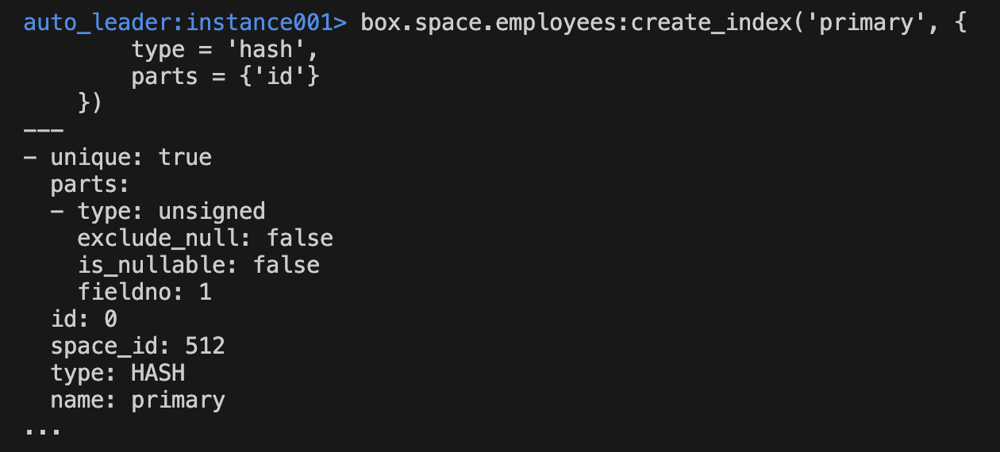

# Конфигурация кластера

Зададим топологию кластера:

- 3 ноды
  - 1 мастер нода
  - 2 слейв ноды реплики


Настроим кластер в режиме Automated Failover: при удалении мастер-ноды на кластере будут происходить выборы нового мастера:


Используем утилиту tt от Tarantool для инициализации окружения:

```bash
tt init
```

В директории instances.enabled добавим файл `instances.yaml`, который определяет запускаемые инстансы:

```yaml
instance001:
instance002:
instance003:
```

В той же директории создаем `config.yaml`, в котором опишем конфигурацию кластера:

```yml
credentials:
  users:
    admin:
      password: "admin"
      roles: [super]
    replicator:
      password: "topsecret"
      roles: [replication]
iproto:
  advertise:
    peer:
      login: replicator
replication:
  failover: election
groups:
  group001:
    replicasets:
      replicaset001:
        instances:
          instance001:
            iproto:
              listen:
                - uri: "127.0.0.1:3301"
          instance002:
            iproto:
              listen:
                - uri: "127.0.0.1:3302"
          instance003:
            iproto:
              listen:
                - uri: "127.0.0.1:3303"
```

В этом файле также определены два пользователя: `admin` и `replicator` с соответствующими правами. В дальнейшем для CRUD операций через API Python будем использовать пользователя `admin`.

# Запуск кластера

Запустим кластер:


Убедимся, что конфигурация валидная и все ноды запустились:


Подключимся к мастеру - им стала нода 1, как можно увидеть из результатов голосования:


Посмотрим текстовую схему топологии кластера:

Ноды 2 и 3 являются репликами мастера - ноды 1

# Схема хранения данных

Создадим схему для сотрудников:

Будем хранить id, имя, позицию и зарплату сотрудника.

Создадим индекс для id:


# Подключение через Python

Напишем простой коннектор к БД. Добавим функции создания сотрудников и выбора всех сотрудников из БД:

```python
def add_employee(employee):
    conn.space("employees").insert(employee)
    print(f"Сотрудник {employee[1]} добавлен")


def get_all_employees():
    result = conn.space("employees").select()
    print("Список сотрудников:")
    for employee in result:
        print(employee)
```

Создадим подключение через `admin` пользователя:

```python
conn = tarantool.connect("localhost", 3301, user="admin", password="admin")
```

Заполним БД тестовыми данными:

```python
add_employee((1, "John Doe", "Manager", 5000))
add_employee((2, "Jane Smith", "Developer", 4000))
get_all_employees()
```

Выполним скрипт:

Он успешно вставил данные в БД.

# Failover

Отключим мастер-ноду и спровоцируем кластер выбрать нового мастера. Также проверим, насколько успешные данные были реплицированы на оставшиеся ноды:


Подключимся ко второй ноде, узнаем о результатах голосования:

Мастером стала третья нода, вторая слейвом.

Подключимся к новому мастеру - третьей ноде и посмотрим информацию по репликам:

Как видим, upstream статус 1-й ноды disconnected, а downstream статус - stopped. То есть 3-я нода считает старого мастера отключенным, а старый мастер говорит, что его отключили, что мы в действительности и сделали.
Вторая нода (instance002) по прежнему работает.

С помощью коннектора на Python проверим, остались ли данные на новом мастере и реплике:

```python
conn = tarantool.connect("localhost", 3303, user="admin", password="admin")
get_all_employees()
```


Действительно, данные сохранились!
